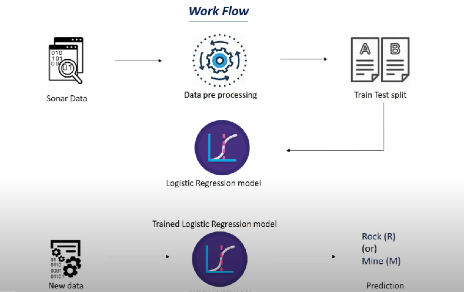

# 🪨 Mine vs Rock Classification

A machine learning project that classifies sonar signals as **Mine** or **Rock**.  
The model was trained in **Google Colab**, and a **Flask web app** was built for deployment.

---

## 📊 Workflow



---

## 📘 Training Notebook

You can see how the model was trained here:  
[Mine_vs_Rock.ipynb](Rock_vs_Mine_Prediction.ipynb)

---

## ⚙️ Tech Stack

- **Python**
- **scikit-learn**
- **Flask**
- **HTML/CSS**
- **Google Colab** (for model training)

---

## 🖥️ Running the Project

1. Clone this repo:
   ```bash
   git clone https://github.com/your-username/mine-vs-rock.git
   cd mine-vs-rock
   ```
2. Install dependencies:
   pip install -r requirements.txt

3. Run the Flask app:
   python app.py

4. Open in browser:

## 📬 Author

**Rahul C Araganji**

- LinkedIn: https://www.linkedin.com/in/rahul-araganji/
- Twitter/X: https://x.com/RahulCA8206
